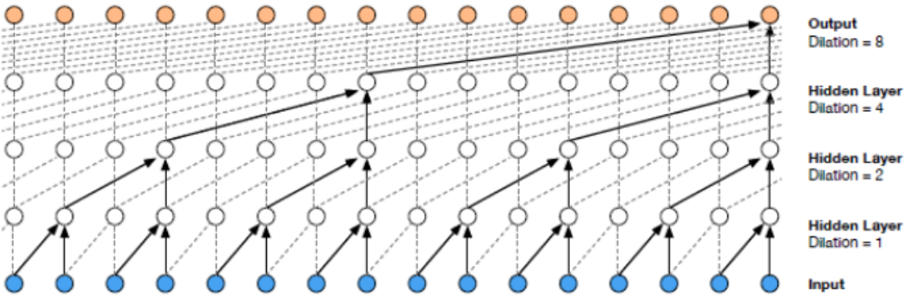

# Report

Auther: Rachel Wang, Mengxi Zhou, Tianyu Xiong from VAIS.bmp

## Table of Contents
- [Overview](#heading-1)
- [Previous Work](#heading-2)
- [Project Goal](#heading-3)
- [Data Preprocessing](#heading-4)
- [Model](#heading-5)
- [Visualization System](#heading-6)
    * [Overview Panel]
    * [Clip Visualization Panel]
    * [Note Visualization Panel]
- [Observation](#heading-7)
    * [Compare the LSTM Vis and WaveNet Vis]
    * [Helpful for Exploration]
- [Future Works](#heading-8)
- [References](#heading-9)
- [Links](#heading-10)

## Overview
The topic of our project is Latent Space Visual Exploration for Traditional Chinese Music, where we extracted features from music using a Wavenet Autoencoder, visualized in our visualization system MusicLatentVIS, and conducted evaluation and analysis to the extracted latent vectors based on the visualization results.

I would like to introduce some backgrounds to our project for short. Feature extraction from music is an active research topic in the field of Music Information Retrieval (MIR), and the effectiveness of the extracted representation of music has got better thanks to the advance of deep learning. However, despite some existing efforts on visualizing music features[1], seldom do researchers conduct visual analysis to understand the latent vectors of music. Furthermore, most studies on MIR focus on western music, where traditional Chinese music, as a distinct music system played by a relatively smaller population, is often neglected. 

Therefore, we would like to extract features of traditional Chinese music, feed them into a visualization system, and see if we are able to draw insights from the visualization as music performers.


## Previous Work
Our project is a continuation of the work done by Shen et al. [2] In the previous work, the music is transformed into spectrograms, whose dimension is 501 by X. X is the number of time steps.  Each time step is 0.025-seconds. Shen et al. trained two autoencoders to extract latent vectors from spectrograms: a fully connected autoencoder for single time step feature extraction (presented as note latent vectors) shown in Fig 1, and a LSTM autoencoder for a sequence of time steps (presented as segment latent vectors) shown in Fig 2.

<p>

<figcaption>
  <h6>Fig 1: Fully Connected Autoencoder for single column of spectrogram[2].</h6>
</figcaption>

<figcaption>
  <h6>Fig 2: LSTM Autoencoder for sequence of columns of spectrogram. (A) is the architecture of the encoder. (B) is the architecture of decoder. (C) shows each layer in encoder takes a sequence of time steps and process one by one (the next depends on all previous) [2].</h6>
</figcaption>
</p>

Shen et al. also designed a visualization system MusicLatentVIS with techniques such as t-SNE 2D projection, parallel coordinate, and heatmap. They applied t-SNE to both original data and note latent vectors  and compared them in 2D projection in order to explore whether note latent vectors with the same instrument/artist/pitch tend to form clusters as the note samples.
<p>

<figcaption>
<h6>Fig 3: t-SNE 2D projection example. Left for original column vector. Right for the encoded version. Color encodes instruments, each individual dense cluster are the notes for a single pitch as labeled (e.g. Mi5, Fa4, etc.).</h6>
</figcaption>
</p>
Parallel coordinate view is used to observe the value distribution in the latent representation. As shown in Fig 4, the user is able to locate the dimension of the highest value for example, and the dimensions with no value.


## Project Goal
There are a couple of aspects that we hope to improve in the previous work. For example, in Fig. 5, each color represents a performer, and each point is a 10 seconds music segment. In spite of some obvious clusters, most points with different colors cluttered the middle part.


<figcaption>
<h6>Fig 4: Segment Latent Vector Visualization.</h6>
</figcaption>

While troubled by this kind of observation, we hypothesized that it might be that the encoder is not strong enough to capture the intrinsic property of the music. 

Therefore we would like to improve the autoencoder model by building another one with Wavenet, a CNN architecture with shown superior performance dealing machine learning tasks involving audio [3]. In addition, we wanted to add more alternative 2D project views from different dimensionality reduction algorithms like PCA and UMAP, and finally, we would do an evaluation and analysis based on the visualization results from our Wavenet Autoencoder, and compare it to the previous work.


## Data Preprocessing
Our dataset contains 325 music files from 44 artists performing on 4 different instruments, which are Bamboo Flute (39 files), Erhu (70 files), Pipa (57 files), and Zheng (159 files). And the data is in the format of the spectrogram, where each column represents a time step of 0.025s and each row represents the energy on a particular frequency bin (there are 501 rows/bins in our spectrogram). An example spectrogram (not from our data) is shown below in Fig 5.


<figcaption>
<h6>Fig 5: An example of a spectrogram</h6>
</figcaption>

To boost the size of the training set and to accommodate our machine power for the training process, we did the following preprocessing steps:
* Randomly sample 100 starting points (timestamps) in each spectrogram according to a uniform distribution. This sampling operation gives us 32500 data points in total.
* From each starting point, take the following 29 time steps with an interval of 20 time steps to form a sequence. From our heuristics, an interval of 20 time steps (20 * 0.025s = 0.5s) will not break the naturality of the music. In this way, each data sample will be a sequence of 30 time steps representing a 14.5s (0.5s*(30-1)= 14.5s) slice from the original music.

```python
def load_data(num_samples=100, num_timesteps=30, timestep_length=20):
    sample_list = []
 
    for instrument in os.listdir(data_path):
        instrument_path = os.path.join(data_path, instrument)
        for artist in os.listdir(instrument_path):
            artist_path = os.path.join(instrument_path, artist)
            for music_file in os.listdir(artist_path):
                this_music_ndarray = np.load(os.path.join(artist_path, music_file))
                this_music_ndarray = np.moveaxis(this_music_ndarray, 0, 1)
                music_length = this_music_ndarray.shape[0]
                # randomly take num_samples starting points
                starting_points = np.random.uniform(0, music_length - timestep_length * num_timesteps, num_samples).astype('int')
                for start_point in starting_points:
                    sample_list.append({'Instrument': instrument,
                                        'Artist': artist,
                                        'Music File Name': music_file,
                                        'Starting Index:': start_point.item(),
                                        'Ending Index': (start_point + timestep_length * (num_timesteps - 1)).item(),
                                        'Interval': timestep_length,
                                        # take sequence with intervals
                                        'Spec Array': this_music_ndarray[start_point: start_point + timestep_length *num_timesteps: timestep_length, :]})
    return sample_list
```
* For the whole dataset, we converted the amplitude values to decibel because numbers in amplitude are usually small that are not  desired during the training.
* We further did an min-max normalization to map all decibel numbers in a range of [0, 1].
* To prevent the decoder from getting information from current time-step and any following time-step, we appended a dummy <start> point at the beginning of the sequence which will be the input to the decoder, and we appended a dummy <end> point at the end of the sequence which will be the output of the decoder. This is a normal practice in a sequence-to-sequence generative model because when the decoder tries to predict the value on the current time step, people do not expect it to get any information from the current time step itself.
* Furthermore, we also flipped the sequence (both input and output) in the decoder part to accommodate the implementation of convolutional layers in Keras. The input sequence to the encoder part remained unchanged. This is mainly because in Keras when the filter has an even filter size, in our case the filter size is always 2, the connection will be to the current and the next position in the input space, where in our case we want the connection to be to the current and the previous position. Thus, we flipped the sequence. And this will not conflict with any other idea of the original model design.

```python
def get_raw_sequence(json_list):
    input_en = []
    input_de = []
    output_de = []
 
    # define start/end dummy vectors
    dummy_start_vec = np.zeros((1, feature_dim))
    dummy_end_vec = np.zeros((1, feature_dim))
    dummy_start_vec[0, 0] = 1.0
    dummy_end_vec[0, -1] = 1.0
 
    # get min/max value from all decibel numbers
    min_db = np.inf
    max_db = - np.inf
    for item in json_list:
        this_seq = item['Spec Array']
        db_seq = amplitude_to_db(this_seq, ref=1.0)
 
        input_en.append(db_seq)
        min_db = min(min_db, db_seq.min())
        max_db = max(max_db, db_seq.max())
 
    for index, item in enumerate(input_en):
        # min-max normalization
        input_en[index] = (item - min_db) / (max_db - min_db)
        # flip the sequence for decoder
        this_input_de = np.flip(input_en[index], 0)
        # append dummy point
        input_de.append(np.append(this_input_de, dummy_start_vec, axis=0))
        output_de.append(np.append(dummy_end_vec, this_input_de, axis=0))
 
    # input of the encoder
    input_en = np.array(input_en)
    # input of the decoder
    input_de = np.array(input_de)
    # output of the decoder
    output_de = np.array(output_de)
 
    return input_en, input_de, output_de
```
* We split the dataset into training-validation set and test set in an 80-20 manner, and further split the training-validation set into training and validation sets in a 90-10 manner. This results in 23,400 training samples, 2,600 validation samples, and 6,500 test samples.
```python
def train_val_test_split(data, train_test_rate=0.8, train_val_rate=0.9):
    train_list, test_list = train_test_split(data, train_size=train_test_rate, random_state=42)
    train_list, val_list = train_test_split(train_list, train_size=train_val_rate, random_state=42)
 
    for item in train_list:
        item['Dataset'] = 'training'
 
    for item in val_list:
        item['Dataset'] = 'validation'
 
    for item in test_list:
        item['Dataset'] = 'test'
    return train_list, val_list, test_list
```
## Model
For a sequence-to-sequence autoencoder, one popular idea is the fully-dense neural network, where the encoder part has several dense layers to reduce the dimensionality of the sequence, while the decoder part consists of several other dense layers to reconstruct the sequence. The dimension-reduced vector from the output of the encoder can be considered as an embedding of the whole sequence.

Another popular idea is the LSTM-based autoencoder, where the encoder has several LSTM layers and the hidden state of the last unit of the top LSTM layer is considered to be the ‘embedding’ and sent to the decoder. The decoder part is also some LSTM layers that take the ‘embedding’ as the input (or take both the ‘embedding’ and the shifted original sequence together as the input) and reconstruct the input sequence.

Both models have been explored by our teammate Rachel and her collaborators in the previous works. In this work, we proposed to use a hybrid autoencoder and tried to see if any improvement might be achieved.

The hybrid network still follows a standard encoder-decoder structure, where the encoder part consists of several ***LSTM layers*** (which is identical to the encoder in LSTM-based autoencoders) and the decoder part borrows ideas from the ***Wavenet*** (a network similar to PixelCNN that we have presented in the class). The hidden state (a vector) of the last LSTM unit in the top LSTM layer of the encoder can be considered as the “embedding” of the input music sequence. And it will be fed into the decoder as an additional input (in addition to the input sequence) that the decoder (Wavenet) can condition on. Assumably, the “embedding” should encode features of the music sequence.


<figcaption>
<h6>Fig 6: Overview of the Wavenet architecture</h6>
</figcaption>


<figcaption>
<h6>Fig 7: Example of dilated causal convolutional layers</h6>
</figcaption>

An overview of Wavenet structure is shown in Fig. 6. In their original task, the authors used raw audio data where the input and the output would be a sequence of numbers (a 1-D vector where each position in the vector represents the information at one time step). In Fig. 6, each dashed rectangle represents a layer in Wavenet. Within each layer, two filters (one normal filter and one gate filter) are formed to learn the feature of the previous layer’s output. The filters always have a size of 2 (in this 1-D case) but have a larger dilation rate (in the power of 2) as the layer goes deeper (as shown in Fig. 7). Also, the condition vector (the ‘embedding’ in our case) will be taken into consideration within the tanh and sigmoid unit. Residual connections and skip connections are also involved in order to allow a large number of layers to be trained properly. More details are referred to the original paper [3].


<figcaption>
<h6>Fig 8: Overview of the autoencoder structure</h6>
</figcaption>

An overview of our autoencoder architecture is shown in Fig 8. The encoder has 3 LSTM layers and the output of the last unit in the top layer will be considered as the ‘embedding’ and will be fed into the decoder. The input to the encoder will be the music sequences in spectrogram format which has a shape of (30, 501), and the output will be the embedding vector of shape (32). For the decoder, in general it follows the design of Wavenet. It takes the music sequence with the dummy <start> vector as the input and takes the music sequence with the dummy <end> vector as the output. Thus the input and the output will both have a shape of (31, 501). Also, the decoder takes the embedding vector as an additional input on which the decoding process will be conditioned. Inside each unit in the convolutional layers, the outputs of the previous layer (x) along with the embedding vector (h) will be computed according to the formula:


In our experiments, the weights for the embedding vector h will be shared within each time step (across all layers) but will remain unshared on different time steps. This may **not** be a good choice since different layers may learn different features from different levels. Sharing the weights across layers may hamper the learning process. But due to the time limit, we did not further experiment with this problem.

Furthermore, the main difference between our task and Wavenet’s original task is that our data is in the format of the spectrogram, meaning all the sequences will be in a format of an (n, m) matrix, where n is the length of the sequence (n_encoder = 30 and n_decoder = 31 in our case) and m is the number of frequency bins in the spectrogram (m = 501 in our case). Overall the architecture follows the Wavenet design but there are two noticeable choices that we can make in the experiment:
* **Extending Wavenet to multi-channel inputs**: to extend the wavenet to multi-channel (each time step is represented by a vector) data, we tried two ideas, namely ***Channel-dependent Filter Conv*** and ***Channel-integrated Filter Conv***. For an input sequence of (31, 501), we first treated frequency bins as different channels and format the data to (31, 1, 501) to adapt the Keras implementation. For ***Channel-dependent Filter Conv***, we learned one individual filter on each individual channel separately. In other words, each input to the conv layer will be separated to 501 * (31, 1, 1) slices and for each (31, 1, 1) slice, one filter (with filter size (2, 1) and an increasing dilation rate as the layer goes deeper) will be learned and still output a (31, 1, 1) tensor. All output slices will be concatenated together to still form a (31, 1, 501) tensor. This can be easily implemented by a function called DepthwiseConv2D in Keras. Another idea is that maybe each channel in a spectrogram should not be learned separately because each note in the music should only be represented by a combination of all frequency bins in the spectrogram. And this type of combination may have some intrinsic rules that should be looked at separately by the filter. For this reason, we tried ***Channel-integrated Filter Conv***. The ***Channel-integrated Filter Conv*** layer takes in a (31, 1, 501) input and learns 501 filters where each filter looks at the input as a whole. And the output of the layer will still be (31, 1, 501). The filter size still remains as (2, 1) with an increasing dilation rate. This is a more common practice in convolutional neural networks and we actually found this produced more meaningful results.
* **Last output layer design**: for the last output layer, we tried two different settings, namely ***Last-conv*** and ***Last-sparse-dense***. ***Last-conv*** follows the original Wavenet’s idea where the last output layer is a convolutional layer where the filter size is (1,1). ***Last-sparse-dense*** is that for each output unit, it connects to all previous time steps in a dense manner. In our implementation this will be connecting to all later units because of the sequence flipping. This type of sparse dense connection is shown in Fig 8 by the dash lines in the top layer.

We show the parallel coordinates and the t-SNE visualization of the results from 4 models here in Fig 9 - Fig 12. The four models are according to all possible combinations of the previous design choices. In Parallel coordinates, each embedding vector will be represented as a polyline from the left to the right. And the value on each position of the embedding vector is shown according to the y-axis. In t-SNE visualization, basically the embedding vectors are projected onto the 2d space and each embedding is shown as a point in the 2d space. As we can see from Fig 9-12, all embeddings in `Channel-dependent Filter Conv + Last-conv` have few dimensions that have value and the t-SNE visualization provides no useful information. For `Channel-dependent Filter Conv + Last-sparse-dense` and `Channel-integrated Filter Conv + Last-conv`, more dimensions in the embedding vectors have actual values, while still a half of the dimensions still remain to be zero for all embeddings. Finally, for `Channel-integrated Filter Conv + Last-sparse-dense`, there are only four dimensions which are useless in the embeddings and the t-SNE visualization shows more meaningful results (some clear clusters). These visualizations simply show that ***Channel-integrated Filter Conv*** and ***Last-sparse-dense*** are better choices for our task.


 
<figcaption>
<h6>Fig 9: Parallel coordinates and t-SNE visualization of Channel-dependent Filter Conv + Last-conv</h6>
</figcaption>

 
<figcaption>
<h6>Fig 10: Parallel coordinates and t-SNE visualization of Channel-dependent Filter Conv + Last-sparse-dense</h6>
</figcaption>

 
<figcaption>
<h6>Fig 11: Parallel coordinates and t-SNE visualization of Channel-integrated Filter Conv + Last-conv</h6>
</figcaption>

 
<figcaption>
<h6>Fig 12: Parallel coordinates and t-SNE visualization of Channel-integrated Filter Conv + Last-sparse-dense</h6>
</figcaption>

Due to the time limit, we did not further look into why some dimensions were not getting any information in each model during training. This remains to be in the future work.

We used Mean-squared-error as the loss function and we used Adam optimizer with a learning rate of 0.0005. When inferencing on the test set, only the embedding vector (output of the encoder) would be taken and visualized. In the following sections, the visualization will be only focused on the results of `Channel-integrated Filter Conv + Last-sparse-dense` model.

Code for the `Channel-integrated Filter Conv + Last-sparse-dense` model construction:
```python
# Encoder: the dimensions of the hidden state of LSTM
# should be a list of numbers, the length of the list indicates how many LSTM layers are used
hidden_dims = [128, 64, 32]
 
time_steps = 30      # how many time steps are taken for each sample
feature_dim = 501           # number of dimensions of the spectrogram
learning_rate = 0.0005
 
def TimeShiftingRearrange(input_tensor, time_steps):
    # sparse dense connection for the top layer
    tensor_list = []
    for i in range(time_steps):
        this_tensor = Lambda(lambda x: x[:, - (i + 1):, :, :])(input_tensor)
        this_flt = Flatten()(this_tensor)
        tensor_list.append(this_flt)
    return tensor_list
 
 
def wavenetBlock(num_filters, filter_size, dilation_rate):
    def f(input_layer, normal_hidden_rshp, gate_hidden_rshp):
        residual = input_layer
        # normal filter
        normal_conv = Conv2D(num_filters, filter_size, padding='same', dilation_rate=dilation_rate, activation='linear')(input_layer)
        normal_sum = Add()([normal_conv, normal_hidden_rshp])
        tanh_out = Lambda(tanh)(normal_sum)
 
        # gate filter
        gate_conv = Conv2D(num_filters, filter_size, padding='same', dilation_rate=dilation_rate, activation='linear')(input_layer)
        gate_sum = Add()([gate_conv, gate_hidden_rshp])
        sig_out = Lambda(sigmoid)(gate_sum)
 
        # gate multiplication
        merged = Multiply()([tanh_out, sig_out])
        # skip
        skip_out = Conv2D(num_filters, (1, 1), padding='same', activation='relu')(merged)
        # residual
        out = Add()([skip_out, residual])
        return out, skip_out
    return f
 
 
def get_decoder(decoder_seq_input, decoder_embd_input, time_steps, feature_dim):
    input_layer = decoder_seq_input
 
    reshape_layer = Lambda(lambda x: K.expand_dims(x, axis=2), name='reshape_input')(input_layer)
 
    # weights for embedding vector
    normal_hidden = Dense(time_steps * feature_dim, activation='linear')(decoder_embd_input)
    gate_hidden = Dense(time_steps * feature_dim, activation='linear')(decoder_embd_input)
    normal_hidden_rshp = Reshape((time_steps, 1, feature_dim))(normal_hidden)
    gate_hidden_rshp = Reshape((time_steps, 1, feature_dim))(gate_hidden)
 
    conv_prep = Conv2D(feature_dim, (1, 1), padding='same', activation='relu')(reshape_layer)
 
    # wavenet layers
    cnn_out1, skip_out1 = wavenetBlock(feature_dim, (2, 1), (1, 1))(conv_prep, normal_hidden_rshp, gate_hidden_rshp)
    cnn_out2, skip_out2 = wavenetBlock(feature_dim, (2, 1), (2, 1))(cnn_out1, normal_hidden_rshp, gate_hidden_rshp)
    cnn_out3, skip_out3 = wavenetBlock(feature_dim, (2, 1), (4, 1))(cnn_out2, normal_hidden_rshp, gate_hidden_rshp)
    cnn_out4, skip_out4 = wavenetBlock(feature_dim, (2, 1), (8, 1))(cnn_out3, normal_hidden_rshp, gate_hidden_rshp)
 
    # skip connection add
    skip_sum = Add()([skip_out1, skip_out2, skip_out3, skip_out4])
    skip_actv = Lambda(relu)(skip_sum)
 
    # 1*1 conv layers, this follows the wavenet paper
    skip_conv1 = Conv2D(feature_dim, (1, 1), padding='same', activation='relu')(skip_actv)
    skip_conv2 = Conv2D(feature_dim, (1, 1), padding='same', activation='relu')(skip_conv1)
 
    # sparse dense connection
    shifted_tensor_list = Lambda(TimeShiftingRearrange, arguments={'time_steps': time_steps})(skip_conv2)
    dense_list = []
    for i, tensor in enumerate(shifted_tensor_list):
        this_dense = Dense(501, activation='tanh')(tensor)
        this_rshp = Lambda(lambda x: K.expand_dims(x, axis=1))(this_dense)
        dense_list.append(this_rshp)
    decoder_output = Lambda(lambda x: concatenate(x, axis=1))(dense_list)
    # decoder_output = Lambda(lambda x: x[:,:,0,:])(skip_conv2)
    return decoder_output
 
 
def get_encoder(encoder_input, hidden_dims):
    input_layer = encoder_input
    num_layers = len(hidden_dims)
    lstm_layers = []
    for index, hidden_dim in enumerate(hidden_dims):
        if index == 0:
            this_lstm_layer = LSTM(hidden_dim, activation='relu', return_sequences=True)(input_layer)
        elif index == num_layers - 1:
            # last layer of the LSTM encoder
            # the output is the final hidden state, which is the embedding weget
            this_lstm_layer = LSTM(hidden_dim, activation='relu', return_sequences=False, name='embedding_layer')(lstm_layers[index - 1])
        else:
            this_lstm_layer = LSTM(hidden_dim, activation='relu', return_sequences=True)(lstm_layers[index - 1])
        lstm_layers.append(this_lstm_layer)
 
    last_lstm_layer = lstm_layers[num_layers - 1]
    return last_lstm_layer
 
 
def get_autoencoder(time_steps, feature_dim, hidden_dims):
    # LSTM encoder
    encoder_input = Input(shape=(time_steps, feature_dim), name='encoder_input')
    encoder_output = get_encoder(encoder_input, hidden_dims)
 
    # wavenet decoder, input/output sequences are modified with dummy <start>/<end>, thus time_steps+1
    decoder_seq_input = Input(shape=(time_steps + 1, feature_dim), name='decoder_input')
    decoder_embd_input = encoder_output
    decoder_output = get_decoder(decoder_seq_input, decoder_embd_input, time_steps + 1, feature_dim)
 
    model = Model(input=[encoder_input, decoder_seq_input], output=decoder_output)
    optimizer = Adam(learning_rate=learning_rate)
    model.compile(loss='mse', optimizer=optimizer, metrics=['cosine_proximity'])
    return model
```

## Visualization System
Visualization is helpful for both understanding data and debugging models. Our visualization panel has three basic parts, i.e. the overview panel (home page), the Clip Visualization Panel (ClipVis page), and the Note Visualization Panel (NoteVis page). By clicking the tab on the navigation bar, people can switch between different panels. The selected tab would be highlighted on the navigation bar. The embedding results of different models can be selected through the uploading box on the right corner. 

### Overview Panel

<figcaption>
<h6>Fig 13: Overview panel. The lines are colored by instruments. This example shows our current best result provided by Channel-integrated Filter Conv + Last-sparse-dense model.</h6>
</figcaption>

Overview panel is specifically for understanding the data. When data is imported into the visualization system, the overview panel would display a parallel plot to show every dimension of the embedding result. As shown in Fig 13, this view gives people a glance of the embedding, for example, the value range in each dimension, the most outstanding instrument in the dataset, and the most meaningful dimension, etc.

### Clip Visualization Panel
We adopted three methods to project our ‘embedding’ into 2D space, i.e. t-SNE, PCA and UMAP. Both t-SNE and UMAP model the similar objects as nearby points, and dissimilar ones as distant points; however, since the two methods work in different schemes, the clusters may look different when projecting to 2D space; for example, our result projected by UMAP usually looks more tight. Hence, making comparison of results of both t-SNE and UMAP is probably helpful to understand the data better. PCA reduces the dimension of ‘embedding’ by decomposing the covariance matrix of the data, so it preserves the distance in the original high dimensional space. 


<figcaption>
<h6>Fig 14: Clip Visualization Panel. From the top to the bottom, there are t-SNE view, PCA view and UMAP view.  This example shows our current best result provided by Channel-integrated Filter Conv + Last-sparse-dense model.</h6>
</figcaption>

The Clip Visualization Panel has three sub panels for displaying the three projections as shown in Fig 14. From the top to the bottom, they are t-SNE view, PCA view, and UMAP view. Each view has five sub displays. The major one is the overview display, which shows all the clips embedding from all four instruments and all the artists. Each of the four small panels stands for one instrument; for instance, the middle two are for BambooFlute and Erhu, and the right two are for Pipa and Zheng. 

### Note Visualization Panel
The Note Visualization Panel incorporates 2D projection from t-SNE and PCA as well as a parallel coordinate sub panel. The note latent vector for this panel comes from the fully connected autoencoder from Shen et al. We recreated the interface and developed a fisheye magnifier effect for the t-SNE projection.

Parallel coordinate view is used to observe the value distribution in the latent representation. From the plot, the user is able to locate the dimension of the highest value for example, and the dimensions with no value.


<figcaption>
<h6>Fig 15: Note Visualization Panel</h6>
</figcaption>

Overall, the panel is composed of t-SNE view, PCA view, and parallel coordinates view from the top to the bottom as shown in Fig 15.


<figcaption>
<h6>Fig. 16: Fisheye magnifier effect for t-SNE projection. Left: original. Right: magnified.</h6>
</figcaption>

In the t-SNE sub panel, before the magnifier is applied, it is hard to check the distances between each note latent vectors in the same cluster of pitch and instrument (e.g. Mi4 in red), but with the magnifier we have a better view of the intra-cluster distances as shown in Fig 16. Note that fish eye magnifier distorts plots a lot, so we only applied the fish eye to t-SNE projection which does not preserve the distance in the original dimension.

## Observation
### Compare the LSTM Vis and WaveNet Vis

 
<figcaption>
<h6>Fig 17: Left: the result of LSTM Autoencoder. Right: the result of WaveNet Autoencoder. </h6>
</figcaption>

From Fig 17 above, we can clearly see that the LSTM Autoencoder has better clustering results on both t-SNE and UMAP view. One thing to be clarified here is why the result in the previous work does not look good. The reason is that in the previous work, the points are encoded in over 40 different colors, each color representing one artist, but 40 colors are not distinctive in human eyes. This time, we upgraded the visual encoding: we marked music segments played by different instruments with unique symbols and then assigned colors to artists who play the same instruments. To be more clear, we also made four subplots for the four instruments. In this way, we can see the segment played by the same artist more easily. 

### Helpful for Exploration


<figcaption>
<h6>Fig 18: One interesting buggy result, produced by Channel-integrated Filter Conv + Last-conv</h6>
</figcaption>

While we adjusted the model, the visualization really helped us analyze the buggy result. In Fig 18, the result is produced by Channel-integrated Filter Conv + Last-conv. We did not find anything through the t-SNE and UMAP views as usual, but we observed special patterns for Bamboo Flute and Erhu on the PCA view. Both of the two instruments produce continuous notes in performance but the other two cannot. So this model is probably strong on extracting instrument features. 


## Future Works
Several points are remained to be in the future work from this project:
* Look into why some dimensions were not getting any information in each model during training.
* In the wavenet decoder, try not to share the weights for the hidden vector across different layers.
* Although we experimented with different model settings to find a better choice, the hyperparameters of the model remained unexplored in this project. An exploration into the hyperparameter space may lead to a better performance.

## References
[1] Swaroop Panda, Vinay P. Namboodiri, and Shatarupa Thakurta Roy.
[2] J. Shen, R. Wang, and H.-W. Shen, “Visual exploration of latent space for traditional Chinese music,” Visual Informatics, 2020.
[3] A. Oord, S. Dieleman, H. Zen, K. Simonyan, O. Vinyals, A. Graves, N. Kalchbrenner, A. Senior, and K. Kavukcuoglu, 2020. *Wavenet: A Generative Model For Raw Audio*. [online] arXiv.org.

## Links

Note Encoder: https://github.com/wangrqw/NoteEncoder.git

Data preprocessing: https://github.com/wangrqw/MUSDB.git

Visualization: https://github.com/wangrqw/VisBoard.git
